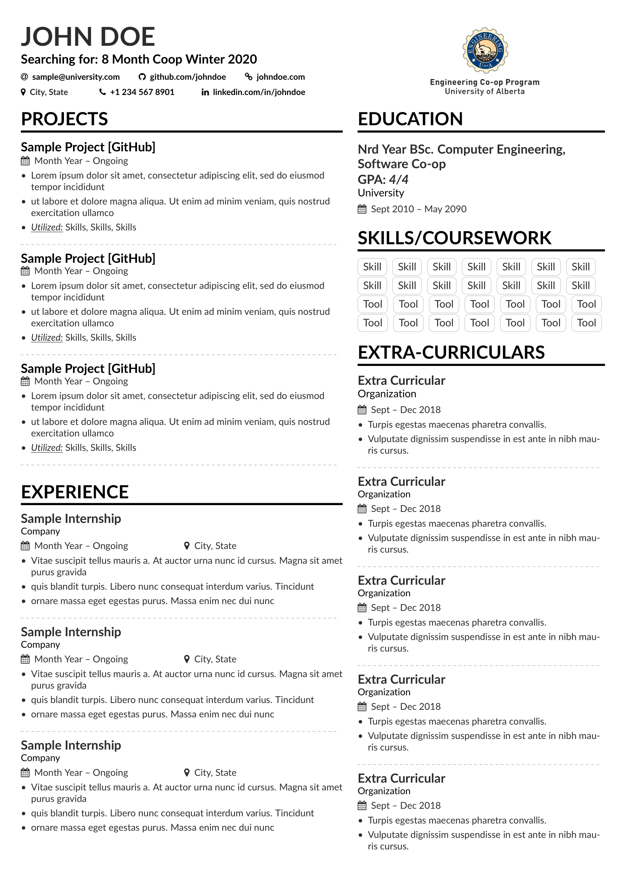

# Resume

### ACKNOWLEDGMENT
This resume is a heavily modified version of AltaCV by LianTze Lim (liantze@gmail.com)
https://github.com/liantze/AltaCV

## How To Use:
- Make sure to have pdflatex + biber installed
- `sudo chmod +x monitor.sh` to get the ease of use script
- Run `./monitor.sh` to get automatic recompilation and cleaning whenever you save
- Open the pdf in evince or similar for automatic refreshing upon save

## Context/Howto
- The resume.tex file contains content for your header aswell as your main bar on the left
- The sidebar.tex file contains content that apears in the right sidebar
- You can change the margins (I have obnoxiously large ones) in the 5th line of resume.tex
- custom functions are defined in the altacv.cls file

